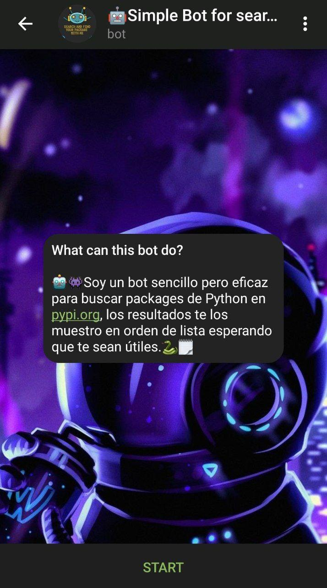
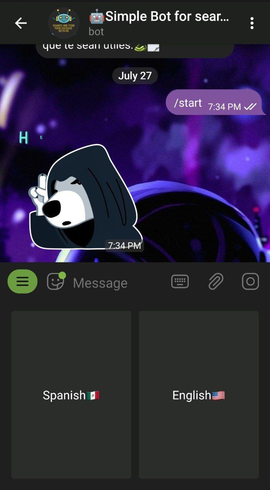
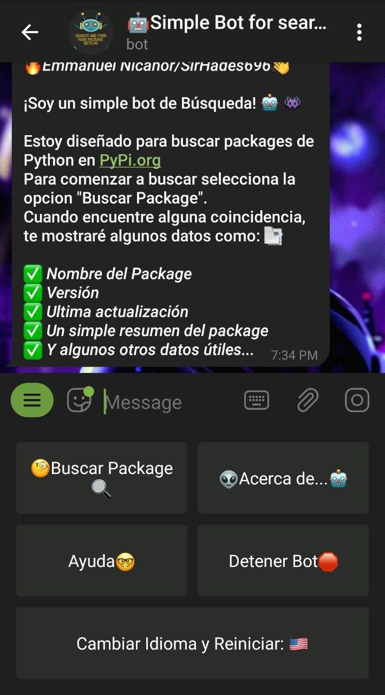
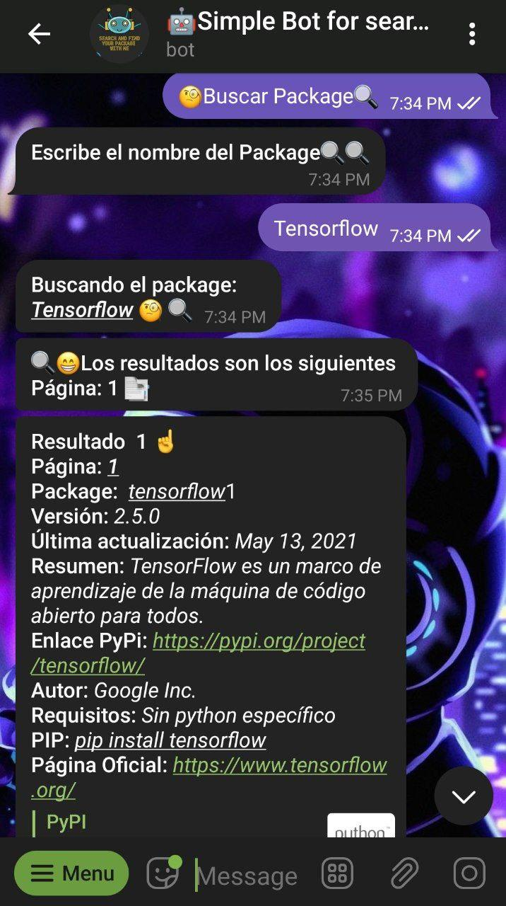
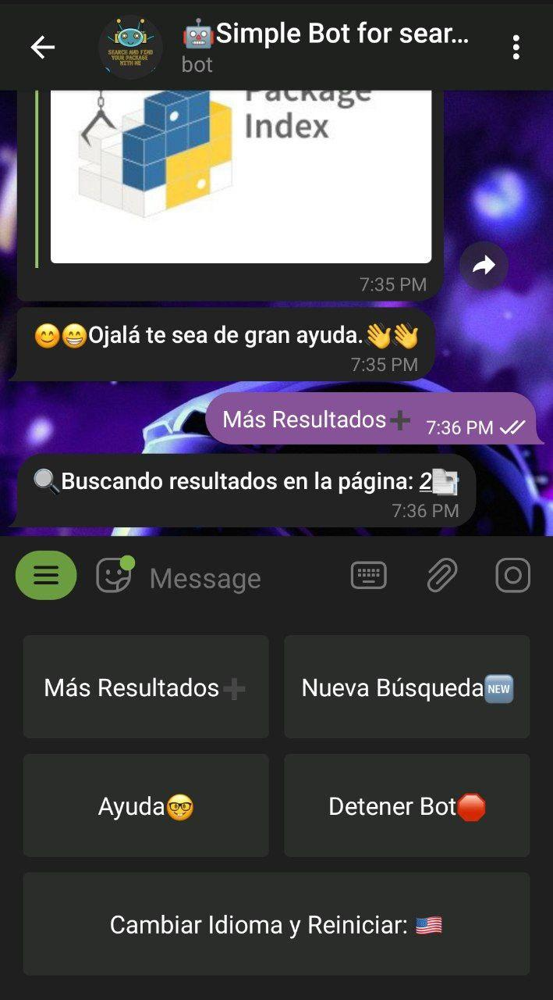
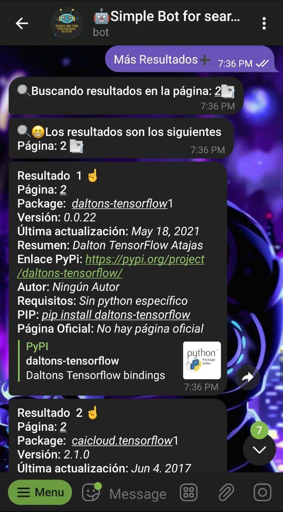
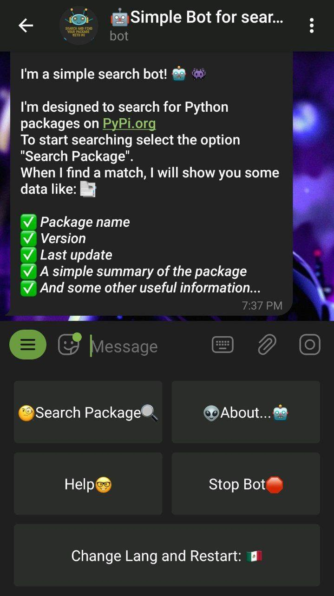
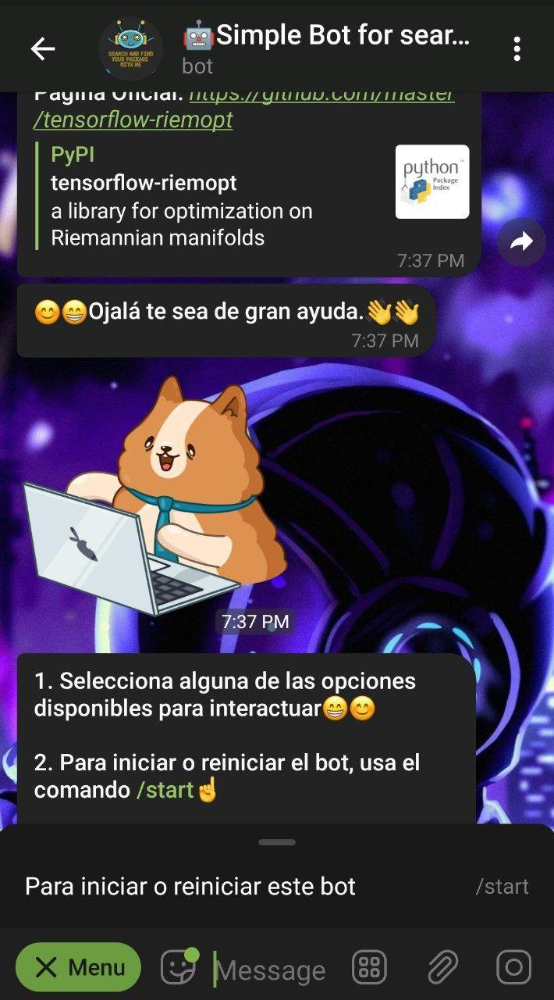

# Simple Bot for search and find python packages
Simple but effective bot to search Python packages in pypi.org, the results are displayed in order of list hoping that they are useful to you. 
This bot used a web scraping with a local API.

# How to run?
Use the command
> `python bot_telegram.py` 
# What do you need?
All Python packages used in this bot are in the file: 
> `requirements.txt`
## How to install all Python packages? 
> `pip install [package] or [package]==[version]` 
# UI and Messages
The first message send to user has information about of bot

When the user presses start these options are displayed, choose a language. 

Depends on the option selected, displays the welcome message.

For search package select "Search Package or Buscar Package" and typing the PP.
This screen displays the first page of pypi results.

If selected "More results or Más resultados", will display the results for second page.

If you need change lang, select "Change lang and Restart or Cambiar idioma y reiniciar"

If you need restart bot, typing /start command or select this option in the menu.

# Resources

Telegram: https://core.telegram.org/bots/api

Bot Telegram: https://python-telegram-bot.readthedocs.io/en/stable/index.html

Emojis: https://unicode.org/emoji/charts/full-emoji-list.html

Pyshortener: https://pyshorteners.readthedocs.io/en/latest/

Googletrans: https://py-googletrans.readthedocs.io/en/latest/

BS4: https://www.crummy.com/software/BeautifulSoup/bs4/doc/